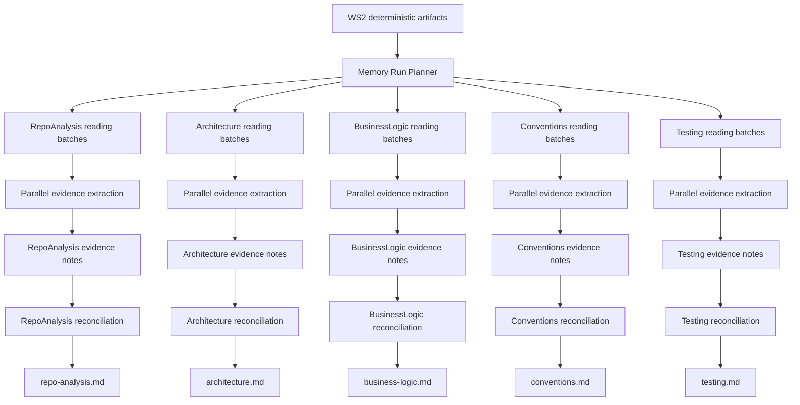

# Bridger — Workstream 5 Memory Orchestration Architecture Decision

## Status

Accepted for Workstream 5 implementation.

This document locks the architecture for Bridger’s LLM-based memory orchestration layer.

Workstreams 1 and 2 are assumed to be implemented. Workstream 5 will build on the deterministic codebase intelligence artifacts generated by Workstream 2.

---

## 1. Decision summary

Workstream 5 will use a **parallel map-reduce memory compiler**.

The memory system will not use:

- one full memory-file rewrite per reading-plan batch;
- an autonomous tool-calling agent that decides what to inspect;
- one single LLM call per memory agent for all repository evidence.

Instead, the architecture is:

```txt
WS2 deterministic artifacts
  ↓
MemoryRunPlanner
  ↓
doc-specific ReadingPlan batches
  ↓
parallel batch evidence extraction
  ↓
compact evidence notes
  ↓
per-agent reconciliation
  ↓
.bridger/memory/*.md
```

The core principle is:

```txt
The deterministic compiler selects and structures evidence.
LLM calls extract compact evidence from bounded batches.
A reconciliation pass compiles evidence into durable memory.
The orchestrator owns scheduling, validation, monitoring, and writing.
```

---

## 2. Why this architecture

The selected architecture balances:

- speed;
- API cost;
- context-window limits;
- deterministic control;
- parallel execution;
- future incremental update support;
- monitoring and debuggability.

It keeps Bridger aligned with the compiled-memory idea while adapting it to codebase-scale ingestion.

The key distinction is that batch calls should **not** generate or rewrite the final memory file. They should generate compact, structured evidence notes. Only the reconciliation call writes the final memory document.

---

## 3. Rejected alternatives

### Alternative 1 — Sequential fold over batches

```txt
memory file v0 + batch 1 → memory file v1
memory file v1 + batch 2 → memory file v2
...
memory file vn
```

Rejected for initial compilation because it is too sequential and slow.

It also risks accumulating early mistakes and repeatedly generating large output.

This pattern remains useful later for `bridger update`, where changed files or changed batches can incrementally update existing memory.

### Alternative 2 — Agentic tool-calling ingestion

```txt
agent receives tools:
- request next batch
- read file
- update memory
- finish
```

Rejected for v0 because it is more expensive, slower, harder to monitor, and less deterministic.

It may be useful later for advanced investigation workflows, but not for the core memory compiler.

### Alternative 3 — One call per memory agent

```txt
all relevant batches
+ all relevant files
→ one LLM call
→ memory file
```

Rejected as the default because realistic repositories can exceed context limits, forcing too much truncation and weakening evidence coverage.

A one-call path may still be acceptable for very small repositories.

---

## 4. Selected architecture

For each specialist memory agent:

```txt
ReadingPlan batches
  ↓
parallel batch evidence extraction
  ↓
EvidenceNote[]
  ↓
reconciliation call
  ↓
target memory file
```

Example for `ArchitectureAgent`:

```txt
architecture batch 1 → architecture evidence note 1
architecture batch 2 → architecture evidence note 2
architecture batch 3 → architecture evidence note 3
...
all architecture evidence notes
+ existing architecture.md if update mode
→ architecture.md
```

Each specialist agent follows the same structure.

Initial v0 agents:

```txt
RepoAnalysisAgent
ArchitectureAgent
BusinessLogicAgent
ConventionsAgent
TestingAgent
```

The five agents can run in parallel because each owns a separate memory target.

---

## 5. High-level flow



---

## 6. Evidence extraction phase

Each reading-plan batch is converted into a bounded LLM input.

Input:

```txt
agent definition
batch metadata
file paths
file roles
file inclusion reasons
file contents
CodebaseMap summary where useful
dummy instructions initially
```

Output:

```txt
EvidenceNote
```

Evidence notes should be compact and should not attempt to become final documentation.

They should capture:

- observed facts;
- supported claims;
- relevant files;
- detected patterns;
- conflicts or contradictions;
- unknowns;
- candidate sections affected in the final memory file.

Suggested conceptual shape:

```ts
type EvidenceNote = {
  agentId: MemoryAgentId;
  batchId: string;
  facts: EvidenceFact[];
  patterns: EvidencePattern[];
  contradictions: EvidenceContradiction[];
  unknowns: string[];
  relevantFiles: string[];
};
```

For the first implementation, this can be simplified and represented as Markdown or JSON-like text. The important part is the orchestration shape, not final prompt quality.

---

## 7. Reconciliation phase

Each specialist agent receives:

```txt
all evidence notes for that memory target
existing memory file, if update mode
target memory file path
required sections
dummy reconciliation instructions initially
```

It outputs the final memory file:

```txt
.bridger/memory/<target>.md
```

The reconciliation call is responsible for:

- merging evidence notes;
- resolving duplicate claims;
- preserving high-confidence observed facts;
- marking weak or unresolved claims as unknowns;
- producing concise, agent-useful memory;
- following the target memory file structure.

---

## 8. Contradiction handling

Contradictions should be handled during reconciliation, not during batch extraction.

Evidence notes should preserve enough provenance to support conflict resolution:

```txt
claim
supporting files
batch id
confidence
conflicting claim, if any
```

Resolution rules:

```txt
observed evidence > inferred evidence > ambiguous evidence
direct source files > indirect or contextual claims
current changed files in update mode > stale memory
unresolved conflict → Unknowns / Caution section
```

The reconciler should not silently choose between conflicting claims when evidence is weak.

---

## 9. Init mode vs update mode

### Init mode

```txt
all relevant reading-plan batches
  ↓
parallel evidence extraction
  ↓
reconciliation
  ↓
new memory files
```

Init mode creates complete memory files from current repository evidence.

### Update mode

```txt
changed files / affected batches
  ↓
evidence extraction for affected context
  ↓
existing memory file
  ↓
reconciled update
```

Update mode should preserve the compiled-memory principle from the LLM wiki pattern: existing memory is maintained rather than recreated blindly.

For v0, update can still regenerate full files if needed, but the architecture should preserve a path toward patch-style maintenance.

---

## 10. Parallelization model

There are two levels of parallelism:

### Level 1 — Agent-level parallelism

These agents can run in parallel:

```txt
RepoAnalysisAgent
ArchitectureAgent
BusinessLogicAgent
ConventionsAgent
TestingAgent
```

### Level 2 — Batch-level parallelism

Within each specialist agent, batch evidence extraction can run in parallel.

The orchestrator should use bounded concurrency, not unbounded `Promise.all`.

Recommended initial policy:

```txt
maxConcurrentLlmCalls = configurable
default for dummy mode: high enough to test orchestration
default for real OpenAI mode: conservative
future gateway mode: controlled by gateway limits
```

---

## 11. Monitoring and run state

The orchestration layer must track progress at both agent and batch level.

Track:

```txt
run started_at
run completed_at
total runtime
agent status
batch status
batch started_at
batch completed_at
batch duration
LLM provider
model profile
token usage when available
evidence note size
reconciliation status
memory file write status
errors
```

Example progress state:

```txt
ArchitectureAgent: 5/7 batches extracted, reconciliation pending
TestingAgent: 3/3 batches extracted, memory written
```

The run should produce a memory run artifact.

Recommended artifact:

```txt
.bridger/artifacts/memory-run-plan.json
```

This artifact may include execution results, or a separate `memory-run-result.json` can be added later if needed.

---

## 12. LLM infrastructure boundary

All LLM calls must go through a modular interface.

Do not let memory agents import the OpenAI SDK directly.

Required interface:

```txt
LLMClient.generateText(request)
```

Current implementation:

```txt
DummyLLMClient
```

Initial real implementation:

```txt
OpenAI direct client
```

Future implementation:

```txt
Bridger Gateway / proxy client
```

This allows Workstream 5 to be built and tested before real API calls are introduced.

---

## 13. Dummy-first implementation rule

Workstream 5 will first be implemented with dummy LLM calls.

Dummy behavior:

```txt
sleep(0.5)
return deterministic fake evidence note or fake memory output
```

This validates:

- orchestration;
- parallel scheduling;
- status tracking;
- memory run artifacts;
- file writing;
- failure handling;
- monitoring;
- CLI integration.

Prompt quality and actual model behavior will be improved later.

---

## 14. Validation rules

The first validation layer can be simple.

Evidence note validation:

```txt
non-empty output
contains agent id
contains batch id
```

Memory file validation:

```txt
non-empty markdown
target memory file has required heading or title
Unknowns section exists
no obvious placeholder failure text
```

This can become stricter later.

---

## 15. Module boundary

Recommended conceptual modules:

```txt
llm/
  LLMClient
  DummyLLMClient
  OpenAIClient later
  GatewayClient later

memory-agents/
  agent definitions
  target files
  required sections
  dummy instructions

memory-orchestrator/
  run planner
  batch scheduler
  evidence extraction runner
  reconciliation runner
  status tracking
  validation
  memory writer
```

Keep these boundaries strict:

```txt
memory agents define what should be produced
orchestrator decides how execution happens
LLM client decides where generation happens
memory store handles .bridger/memory writes
```

---

## 16. Locked Workstream 5 architecture

The locked Workstream 5 architecture is:

```txt
Parallel map-reduce memory compilation
+ deterministic ReadingPlan-driven context
+ compact evidence notes per batch
+ reconciliation into canonical memory files
+ dummy-first LLM client
+ future OpenAI/proxy-compatible LLM interface
+ agent and batch-level monitoring
```

This architecture should be implemented before optimizing prompts.

The immediate goal is not perfect memory quality.

The immediate goal is a clean, maintainable orchestration layer that can later support high-quality specialist prompts and real LLM calls.
