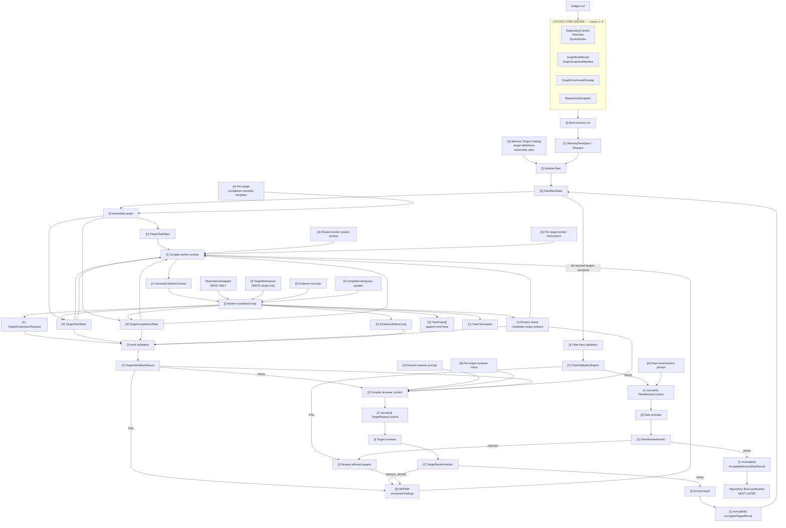

# Bridger Memory Harness — Contracts, Interfaces & Artifacts Map

## 1. Legend

I would use four categories throughout the design:

```text
[C]  Contract
     Typed input/output object or persisted product object.

[S]  State contract
     Mutable or immutable runtime state whose shape matters to control flow.

[I]  Interface
     Transformation: inputs → behavior → outputs/state transition.

[A]  Artifact
     Prompt, target definition, checklist template, rubric, policy, etc.
     Consumed by the runtime/model but not itself a runtime code boundary.
```

The implementation-oriented course is useful for identifying candidate boundaries such as task specs, state, contexts, checkpoints, completion requests, and verdicts, but those example schemas should not be imported as Bridger contracts. 

---

# 2. The complete system in one diagram



That is the harness.

Everything else should fit underneath one of these boxes.

The core loop directly follows the long-running-agent principle that durable state, rather than conversation history, records execution reality, while the runtime—not the model—decides continuation and completion.  

---

# 3. The five contracts that should dominate the mental model

Most other contracts are support objects. These five are the ones I would keep in mind while designing.

## 3.1 `[C] MemoryFleetSpec`

**Immutable description of what this fleet run is.**

Conceptually binds:

```text
repository identity/revision
graph snapshot
enrichment overlay?
target catalog/version
activated targets
runtime/model profiles
budgets
output/runtime roots
```

It answers:

> What exact memory-generation run are we performing?

The upstream repository, graph and enrichment authorities are already locked, and Layer 6 already gives agents a `RepositoryNavigator` rather than a new composite persisted graph.  

---

## 3.2 `[C] TargetTaskSpec`

**Immutable description of one instantiated target task.**

Conceptually:

```text
fleet/run identity
target identity
target definition/version
completion-contract version
repository/snapshot identities
worker/reviewer profiles
permissions
budgets
target workspace
```

It answers:

> What exactly was this worker assigned?

It should never contain mutable progress.

---

## 3.3 `[S] TargetTaskState`

**Authoritative operational state of one target.**

Conceptually:

```text
phase
cycle/attempt counters
budget usage

working summary
open questions

current artifact references
current evidence references

hard-validation findings
review findings
fleet findings

checkpoint
last progress
termination/error state
```

It answers:

> Where is this target execution right now?

This should be the main object loaded after a crash or context reset.

The locked high-level design already separates task definition, execution state, artifact state, evidence state, evaluation state, and trace conceptually; we do not necessarily need separate top-level files/classes for every category. 

---

## 3.4 `[S] TargetCompletionState`

This deserves to be **separate from general task state**.

It is the runtime version of the per-target completion checklist.

```text
TargetCompletionState
    ├── obligation A → uninvestigated
    ├── obligation B → covered
    ├── obligation C → unknown
    └── obligation D → not-applicable
```

The locked vocabulary is exactly:

```text
uninvestigated
covered
not-applicable
unknown
```

and no required/applicable criterion may remain `uninvestigated` at successful completion. 

This gives us an important distinction:

```text
[A] TargetCompletionChecklist
        static definition of what must be investigated
                     ↓ instantiate
[S] TargetCompletionState
        current runtime resolution of those obligations
```

This is probably **the next contract pair we should design in detail**.

The worker can investigate and propose/update semantic resolution. The runtime owns whether the resulting state satisfies the completion gate.

---

## 3.5 `[S] FleetRunState`

The global state should stay shallow.

Conceptually:

```text
fleet identity
source identities

targets:
    architecture → RUNNING
    testing → ACCEPTED
    conventions → REPAIR
    ...

global budget/usage
scheduler state

fleet validation findings
fleet reconciliation findings

fleet phase/status
```

It answers:

> Where is the fleet globally?

It should **reference target states**, not duplicate their contents.

---

# 4. Chronological interface map

## Stage map

| Stage  | Name                          | Concise responsibility                                                                                                                         |
| ------ | ----------------------------- | ---------------------------------------------------------------------------------------------------------------------------------------------- |
| **0**  | Upstream handoff              | Bind the memory harness to the exact repository, graph snapshot, enrichment overlay, and Layer 6 navigation surface.                           |
| **1**  | Fleet & target initialization | Materialize the fleet run, target assignments, initial runtime states, and default-`uninvestigated` completion states from the target catalog. |
| **2**  | Scheduling                    | Select which targets may execute under dependencies, concurrency, provider limits, and budgets.                                                |
| **3**  | Context hydration             | Compile durable task state + instructions + current artifacts/findings into the bounded context given to the worker.                           |
| **4**  | Worker cycle                  | Worker explores the repository, records evidence, updates semantic completion, and writes candidate knowledge.                                 |
| **5**  | Persistence & recovery        | Persist state changes, trace events, artifact versions, and recoverable checkpoints throughout execution.                                      |
| **6**  | Finalization request          | Worker explicitly transfers control back to the runtime because it believes the target is ready for evaluation.                                |
| **7**  | Hard validation               | Deterministic code verifies mechanical completion, evidence integrity, identities, permissions, and artifact invariants.                       |
| **8**  | Target review                 | Fresh read-only reviewer judges semantic/artifact quality against the target rubric.                                                           |
| **9**  | Repair                        | Validation/reviewer findings are routed back into a new worker cycle. No separate repair agent is required.                                    |
| **10** | Target acceptance             | Freeze the exact locally accepted target result after both hard validation and review pass.                                                    |
| **11** | Fleet hard validation         | Deterministically verify that all accepted targets form a structurally compatible fleet.                                                       |
| **12** | Fleet reconciliation          | Reviewer checks cross-target duplication, contradiction, ownership, terminology, and organization; affected targets can be reopened.           |
| **13** | Fleet acceptance              | Produce the immutable accepted memory-fleet result for Repository Brain publication.                                                           |

The target contract already locks the semantic completion vocabulary and requires applicable obligations to leave `uninvestigated` before acceptance. 

---

## Stage 0 — Upstream handoff

Already largely locked.

```text
RepositoryContext
FileIndex
SymbolIndex
GraphBuildResult
GraphEnrichmentOverlay?
        ↓
RepositoryNavigator
```

Layer 6 is explicitly the shared read surface across these immutable authorities, including graph traversal, file/symbol navigation and bounded source evidence. The memory layer should reuse it rather than invent repository-discovery contracts again. 

### Interface

```text
bind_memory_run(upstream identities, configuration)
    → MemoryFleetSpec
```

### Artifacts

```text
Memory Target Catalog                LOCKED
target semantic definitions          LOCKED
cross-target ownership rules         LOCKED
target completion semantics          LOCKED
```

---

# 5. Stage 1 — Fleet/task instantiation

```text
MemoryFleetSpec
+
MemoryTargetCatalog
+
completion checklist definitions
        ↓
initialize_fleet()
        ↓
FleetRunState
+
TargetTaskSpec × N
+
TargetTaskState × N
+
TargetCompletionState × N
```

This is where **default-fail/default-uninvestigated state is materialized**.

Anthropic's source pattern specifically favors starting requirements unresolved/failing and earning completion rather than assuming it. 

### Interfaces

```text
initialize_fleet()
instantiate_target()
```

### Main design work remaining

The shapes of:

```text
MemoryFleetSpec
FleetRunState
TargetTaskSpec
TargetTaskState
TargetCompletionState
```

---

# 6. Stage 2 — Scheduling

Scheduling should transform fleet state, not introduce a new semantic layer.

```text
FleetRunState
        ↓
select runnable targets
        ↓
start/resume target runtime
```

### Interface

```text
schedule_runnable_targets(FleetRunState)
```

The locked design already says concurrency is runtime-owned, target state is isolated, sibling failure does not automatically invalidate successful targets, and dependencies must be explicit. 

A dedicated `SchedulerState`, leasing system, queue contract, etc. is probably unnecessary for local V0 unless implementation requires it.

---

# 7. Stage 3 — Context hydration

This is the main **state → model** boundary.

```text
TargetTaskSpec
+
TargetTaskState
+
TargetCompletionState
+
candidate artifacts
+
current evidence
+
open repair findings
+
remaining budget
+
[A] worker instructions
        ↓
ContextCompiler
        ↓
WorkerContext
        ↓
LLMClient
```

### `[C transient] WorkerContext`

It should be a compiled execution view, not authoritative state.

Conceptually:

```text
instructions
target objective/scope
source identities
completion obligations + current state
working/progress summary
complete candidate-artifact inventory
unresolved findings
remaining budget
tool identities
```

### What should *not* be automatically hydrated

```text
full historical transcript
complete trace
all old tool outputs
whole repository
whole graph
sibling worker histories
reviewer reasoning
```

The locked design explicitly requires context reconstruction from durable state, with repository evidence progressively obtained through Layer 6 rather than dumped into the prompt.  

### Artifacts

```text
shared worker system prompt
per-target worker instruction pack
```

These can be placeholders during runtime implementation.

---

# 8. Stage 4 — One worker cycle

The model itself does not directly mutate runtime JSON.

It operates through interfaces.

```text
WorkerContext
      ↓
worker model/tool loop
      │
      ├── RepositoryNavigator       read repository
      ├── TargetWorkspace           edit candidate knowledge
      ├── EvidenceRecorder          record grounded evidence
      ├── CompletionStateUpdater    resolve obligations
      └── FinalizationControl       request evaluation
```

This stage continuously affects three different things:

```text
EXECUTION
TargetTaskState

SEMANTIC PROGRESS
TargetCompletionState

PRODUCT CANDIDATE
Markdown / metadata / claims / evidence
```

And simultaneously appends:

```text
TaskEvent[]
```

to the trace.

That separation is critical. Runtime state and the generated knowledge product are not the same thing. The implementation course gives the same useful distinction between runtime progress and final knowledge bundles. 

---

# 9. Stage 5 — Persistence, trace and checkpoints

These are cross-cutting rather than a separate semantic phase.

## `[C] TaskEvent`

Append-only record of:

```text
model call
tool call/result
artifact mutation
evidence mutation
completion-state update
finalization request
state transition
validation
review
retry/error
budget usage
```

Trace answers:

> How did we get here?

## `[C] TaskCheckpoint`

Recoverable snapshot/reference to:

```text
TargetTaskState
TargetCompletionState
candidate artifact versions/digests
evidence state
source identities
```

Checkpoint answers:

> From what exact durable point may execution resume?

The locked design explicitly separates compact state from detailed trace. 

No database or elaborate event-sourced architecture is implied. Ordinary filesystem state is consistent with the theoretical course's emphasis on durable structured files. 

---

# 10. Stage 6 — Finalization request

This should be a very small but explicit boundary.

```text
worker
   ↓
request_finalization()
   ↓
[C] TargetFinalizationRequest
```

Meaning only:

> The worker believes its current candidate is ready for runtime evaluation.

It **does not mean**:

```text
completed = true
accepted = true
all criteria passed
```

The runtime receives it and changes phase.

This implements one of the strongest locked rules: `RUNNING → ACCEPTED` is impossible; evaluation must intervene. 

---

# 11. Stage 7 — Hard validation

```text
TargetTaskSpec
TargetTaskState
TargetCompletionState
candidate artifact set
EvidenceReference[]
TargetFinalizationRequest
        ↓
validate_target()
        ↓
TargetValidationReport
```

### `[C] TargetValidationReport`

Structured deterministic result:

```text
PASS
```

or:

```text
FAIL
findings[]
```

Hard validation owns things code can actually establish:

```text
source/snapshot compatibility
write boundaries
artifact integrity
evidence-reference validity
completion-state structural requirements
runtime invariants
```

It explicitly does **not** decide whether prose correctly understands repository behavior. 

### Failure

```text
TargetValidationReport.FAIL
        ↓
findings added to TargetTaskState
        ↓
phase = REPAIR
        ↓
new WorkerContext
```

No generic retry is required. This is semantic repair.

---

# 12. Stage 8 — Reviewer

Only after hard validation:

```text
candidate artifacts
+
target contract
+
hard-validation report
+
[A] reviewer system prompt
+
[A] target rubric
        ↓
compile_review_context()
        ↓
TargetReviewContext
        ↓
review_target()
        ↓
TargetReviewVerdict
```

### `[C] TargetReviewVerdict`

```text
PASS
```

or:

```text
NEEDS_WORK
findings[]
```

The reviewer is:

```text
fresh-context
read-only
artifact-focused
```

and, importantly, **has no RepositoryNavigator in Bridger V0**. This is one place where the locked Bridger design intentionally overrides the more generic implementation-course example. 

### Artifacts

```text
shared reviewer system prompt
per-target reviewer rubric
```

---

# 13. Stage 9 — Repair loop

Both validation and review failures converge on one mechanism:

```text
structured findings
+
current target state
+
current candidate artifacts
        ↓
compile repair worker context
        ↓
worker
```

There does not need to be a special `RepairAgent`.

`REPAIR` is primarily a **runtime phase/context mode**.

The worker remains free to:

```text
patch
rewrite
split/merge documents
reorganize the target
discard a weak structure
explore additional repository evidence
```

before requesting finalization again. This preserves the long-running-agent principle that feedback should permit reimplementation rather than trapping the worker in endless local patching. 

---

# 14. Stage 10 — Local target acceptance

```text
hard validation PASS
+
review PASS
        ↓
accept_target()
        ↓
[C] AcceptedTargetResult
```

### AcceptedTargetResult

Immutable reference to the exact candidate that passed:

```text
target identity
contract version
repository/snapshot identities
accepted artifact set + digests
accepted completion state
evidence references
validation report ref
review verdict ref
provenance
```

The runtime updates:

```text
TargetTaskState.phase = ACCEPTED
FleetRunState[target] = ACCEPTED
```

The exact schema remains to be designed.

---

# 15. Stage 11 — Fleet gates

When every required target is locally accepted:

```text
AcceptedTargetResult[]
        ↓
validate_fleet()
        ↓
FleetValidationReport
```

This is deterministic global integrity.

Examples already established in the locked design include:

```text
every required target accepted
same repository revision
compatible graph/enrichment identities
valid cross-target links/identities
correct target boundaries
no failed/stale candidate included
internally coherent fleet state
```


---

# 16. Stage 12 — Fleet reconciliation

```text
AcceptedTargetResult[]
+
FleetValidationReport
+
[A] fleet reconciliation prompt
        ↓
FleetReviewContext
        ↓
fleet reviewer
        ↓
FleetReviewVerdict
```

It judges generated knowledge as a corpus:

```text
duplication
contradictions
terminology
scope ownership
cross-target leakage
organization
```

No repository rediscovery occurs. 

If there are issues:

```text
FleetReviewFinding
        ↓
route to affected target(s)
        ↓
ACCEPTED → REPAIR
        ↓
normal target loop
        ↓
hard validation
        ↓
target reviewer
        ↓
ACCEPTED
        ↓
fleet gates again
```

There is no privileged shortcut around local gates.

---

# 17. Stage 13 — Fleet acceptance

```text
all targets accepted
+
FleetValidationReport.PASS
+
FleetReviewVerdict.PASS
        ↓
AcceptedMemoryFleetResult
```

That is the **final output contract of the memory harness**.

It is then consumed by Repository Brain assembly/publication.

The memory harness must stop at this authority boundary; it does not publish the Brain itself. 

---

# 18. Contract ownership at a glance

| Contract / state              | Created by                       | Mutable by                                    | Purpose                         |
| ----------------------------- | -------------------------------- | --------------------------------------------- | ------------------------------- |
| `MemoryFleetSpec`             | runtime                          | nobody                                        | Bind run identity/configuration |
| `FleetRunState`               | runtime                          | runtime                                       | Global execution reality        |
| `TargetTaskSpec`              | runtime                          | nobody                                        | Immutable target assignment     |
| `TargetTaskState`             | runtime                          | runtime                                       | Target lifecycle/progress       |
| `TargetCompletionState`       | runtime                          | worker through controlled interface + runtime | Semantic obligation progress    |
| Candidate knowledge artifacts | worker                           | worker via `TargetWorkspace`                  | Product being generated         |
| `EvidenceReference`           | worker via runtime tool          | controlled runtime operation                  | Ground claims/progress          |
| `TaskEvent`                   | runtime                          | append-only runtime                           | Trace                           |
| `TaskCheckpoint`              | runtime                          | runtime                                       | Recovery                        |
| `TargetFinalizationRequest`   | worker through runtime interface | immutable                                     | Transfer to evaluation          |
| `TargetValidationReport`      | hard validator                   | immutable                                     | Deterministic evaluation        |
| `TargetReviewVerdict`         | reviewer                         | immutable                                     | Artifact quality evaluation     |
| `AcceptedTargetResult`        | runtime                          | immutable                                     | Locally accepted target         |
| `FleetValidationReport`       | runtime validator                | immutable                                     | Global deterministic gate       |
| `FleetReviewVerdict`          | fleet reviewer                   | immutable                                     | Cross-target reconciliation     |
| `AcceptedMemoryFleetResult`   | fleet runtime                    | immutable                                     | Handoff to publication          |

This table is probably the most useful summary of the whole architecture.

---

# 19. Artifact map

Artifacts should remain visibly separate from runtime contracts.

### Already locked product artifacts

```text
Memory Target Catalog
target definitions
target scope/exclusions
cross-target ownership rules
completion vocabulary
semantic completion obligations
target activation semantics
```

The target catalog explicitly defers concrete runtime schemas, persistence, completion-state storage, evidence-reference schemas, tools, reviewer schemas and checkpoint design to this next phase. 

### Already drafted / can evolve independently

```text
Shared worker system prompt
Per-target worker instruction packs

Shared reviewer system prompt
Per-target reviewer rubrics

Fleet reconciliation prompt
```

These can be versioned artifacts loaded through the contracts above.

### Still worth defining as artifacts

Most importantly:

```text
Per-target completion checklist templates
```

And this is where the earlier confusion disappears:

```text
CHECKLIST CONTENT
= artifact

CHECKLIST INSTANCE + statuses
= runtime state contract
```

---
# 20. Contract & state inventory

Names marked **provisional** describe a required boundary but are not intended to lock the final class name yet.

| Contract / State                                        | Kind                    | Parent                                               | Stage                                 | Created / owned by                    | Mutable by                                    | Purpose                                                                                                                                                                                                                                                                                |
| ------------------------------------------------------- | ----------------------- | ---------------------------------------------------- | ------------------------------------- | ------------------------------------- | --------------------------------------------- | -------------------------------------------------------------------------------------------------------------------------------------------------------------------------------------------------------------------------------------------------------------------------------------- |
| **`MemoryFleetSpec`**                                   | Contract                | —                                                    | **0 → 1**                             | Fleet runtime                         | Immutable                                     | Immutable definition of one memory-generation run. Binds the run to the exact repository/revision, graph snapshot, optional enrichment, activated target catalog/version, runtime/model profiles, budgets, and output/runtime locations.                                               |
| **`FleetRunState`**                                     | State                   | —                                                    | **1 → 13**                            | Fleet runtime                         | Fleet runtime                                 | Authoritative global execution state of the memory fleet: fleet phase/status, target statuses, scheduling eligibility, global usage/budgets, and fleet-level validation/reconciliation findings. It should reference target state rather than duplicate it.                            |
| **`TargetTaskSpec`**                                    | Contract                | `MemoryFleetSpec`                                    | **1 → 10**                            | Fleet runtime                         | Immutable                                     | Immutable assignment for one target worker. Defines exactly what target is being executed, its contract/version, source identities, workspace boundary, profiles, permissions, and target-specific budgets.                                                                            |
| **`TargetTaskState`**                                   | State                   | `FleetRunState`                                      | **1 → 10**                            | Target runtime                        | Target runtime                                | Authoritative operational state of one target execution: lifecycle phase, cycles/attempts, usage, working progress, artifact/evidence references, questions, findings, errors, and recovery information. Answers **“where is this target execution now?”**                             |
| **`TargetCompletionState`**                             | State                   | `TargetTaskState`*                                   | **1 → 10**                            | Runtime from checklist template       | Worker through controlled interface + runtime | Semantic completion state only. Tracks every target obligation as `uninvestigated`, `covered`, `not-applicable`, or `unknown`. Answers **“which semantic responsibilities have actually been investigated/resolved?”**                                                                 |
| **Completion item state**                               | Substate                | `TargetCompletionState`                              | **1 → 10**                            | Runtime                               | Worker through controlled operation           | State of one individual semantic completion obligation, including its completion vocabulary value and whatever minimal justification/evidence links we later decide are required.                                                                                                      |
| **`WorkerContext`**                                     | Transient contract      | —                                                    | **3 → 4 / 9 → 4**                     | Context compiler                      | Immutable for one compiled cycle              | Exact bounded model-facing view for one worker cycle. Combines instructions, task spec, relevant durable state, completion progress, complete candidate-artifact inventory, unresolved findings, budgets, and allowed tool identities. Candidate-artifact contents and detailed evidence are retrieved on demand during Stage 4. It is **not authoritative state**.    |
| **Candidate target artifacts** *(provisional contract)* | Product contract/state  | `TargetTaskSpec`                                     | **4 → 10**                            | Worker                                | Worker through target workspace               | Current evidence-backed knowledge product being created inside the assigned target: Markdown plus whatever metadata/claims/sidecars the final knowledge-bundle contract requires. This is the product under evaluation, not runtime progress state.                                    |
| **Artifact reference / manifest entry** *(provisional)* | Subcontract             | Candidate target artifacts / `TargetTaskState`       | **4 → 10**                            | Runtime/workspace                     | Runtime                                       | Stable runtime reference to a generated artifact and its current version/digest, allowing state, validation, checkpoints, and accepted results to refer to exact candidate contents without embedding all contents in task state.                                                      |
| **`EvidenceReference`**                                 | Contract                | Candidate knowledge / completion state as referenced | **4 → 13**                            | Worker through evidence interface     | Controlled runtime operation                  | Revision-bound pointer from generated knowledge or completion progress back to repository evidence: file/range, symbol, graph entity, configuration fact, test, etc. Allows grounding and later mechanical validation.                                                                 |
| **`TaskEvent`**                                         | Contract                | Target execution / trace                             | **4 → 10**                            | Runtime                               | Append-only                                   | One structured trace record describing something that happened: model call, tool call/result, artifact mutation, evidence registration, completion update, phase transition, validation, review, retry, error, budget usage, etc. Ordered `TaskEvent[]` is the target execution trace. |
| **`TaskCheckpoint`**                                    | Contract/state snapshot | `TargetTaskState`                                    | **5 → 10**                            | Runtime                               | Runtime creates new checkpoints               | Recoverable representation/reference of a known target execution point: runtime state, completion state, artifact versions/digests, evidence state, identities, and relevant counters. Used to resume without reconstructing execution from conversation history.                      |
| **`TargetFinalizationRequest`**                         | Transition contract     | `TargetTaskState`                                    | **6 → 7**                             | Worker through finalization interface | Immutable                                     | Explicit signal that the worker believes its current candidate is ready for evaluation. It transfers control to the runtime; it **does not** mark the target complete or accepted.                                                                                                     |
| **`TargetValidationReport`**                            | Contract                | —                                                    | **7 → 8 / 9**                         | Hard validator                        | Immutable                                     | Deterministic verdict over the current target candidate. Records PASS/FAIL and structured findings for mechanical requirements such as source identity, evidence validity, write boundaries, completion-state gates, and artifact integrity.                                           |
| **Validation finding** *(provisional)*                  | Subcontract             | `TargetValidationReport`                             | **7 → 9**                             | Hard validator                        | Immutable                                     | One actionable deterministic failure with sufficient structured information for the runtime and worker to understand exactly what invariant failed and what target/artifact/state it concerns.                                                                                         |
| **`TargetReviewContext`**                               | Transient contract      | —                                                    | **8**                                 | Context compiler                      | Immutable                                     | Fresh read-only reviewer input compiled from the target contract/rubric, candidate artifacts, relevant completion/metadata state, and hard-validation report. It intentionally excludes repository-navigation capability and worker reasoning history.                                 |
| **`TargetReviewVerdict`**                               | Contract                | —                                                    | **8 → 9 / 10**                        | Target reviewer                       | Immutable                                     | Reviewer decision: PASS or NEEDS_WORK, with structured artifact-quality findings covering coverage, organization, duplication, scope, consistency, terminology, uncertainty treatment, and writing quality.                                                                            |
| **Review finding** *(provisional)*                      | Subcontract             | `TargetReviewVerdict`                                | **8 → 9**                             | Reviewer                              | Immutable                                     | One concrete semantic/artifact-quality issue returned to the worker repair loop. Should identify the violated rubric concern and affected artifact/scope sufficiently precisely for repair.                                                                                            |
| **Repair findings state**                               | Substate                | `TargetTaskState`                                    | **7/8 → 9 → 4**                       | Runtime from reports/verdicts         | Runtime                                       | Current unresolved hard-validation, target-review, or later fleet-review findings that must be hydrated into the next worker cycle. This is likely a projection/reference to findings rather than a separate top-level persisted model.                                                |
| **`AcceptedTargetResult`**                              | Contract                | `MemoryFleetSpec` / target                           | **10 → 13**                           | Runtime                               | Immutable                                     | Frozen identity of the exact target candidate that passed both local gates. References accepted artifact digests, completion state, evidence, repository/snapshot identities, target contract version, validation report, reviewer verdict, and provenance.                            |
| **`FleetValidationReport`**                             | Contract                | —                                                    | **11 → 12 / 9**                       | Fleet hard validator                  | Immutable                                     | Deterministic whole-fleet verdict verifying that the locally accepted targets are mutually compatible: required targets accepted, revision/snapshot identities align, links/ownership boundaries are structurally valid, and no stale/failed candidate is included.                    |
| **Fleet validation finding** *(provisional)*            | Subcontract             | `FleetValidationReport`                              | **11 → 9**                            | Fleet validator                       | Immutable                                     | One global structural/integrity issue, including which accepted target(s) must be reopened when repair is required.                                                                                                                                                                    |
| **`FleetReviewContext`**                                | Transient contract      | —                                                    | **12**                                | Context compiler                      | Immutable                                     | Read-only corpus view supplied to the fleet reviewer: accepted target outputs, target catalog/ownership rules, relevant metadata, and fleet validation report. No repository rediscovery.                                                                                              |
| **`FleetReviewVerdict`**                                | Contract                | —                                                    | **12 → 9 / 13**                       | Fleet reviewer                        | Immutable                                     | PASS or ISSUES judgment over the complete generated memory corpus, focusing on cross-target duplication, contradictions, terminology, ownership leakage, segmentation, and global usability.                                                                                           |
| **Fleet review finding** *(provisional)*                | Subcontract             | `FleetReviewVerdict`                                 | **12 → 9**                            | Fleet reviewer                        | Immutable                                     | One reconciliation issue with explicit affected target(s), so the runtime can reopen only the necessary target executions and route the finding into their normal repair loops.                                                                                                        |
| **`AcceptedMemoryFleetResult`**                         | Contract                | `MemoryFleetSpec`                                    | **13 → Repository Brain publication** | Fleet runtime                         | Immutable                                     | Final output of the memory harness. Identifies the complete reconciled set of accepted target results and their common source/provenance, proving that local gates, fleet validation, and fleet reconciliation all passed.                                                             |

* I would treat `TargetCompletionState` as a **logical substate of `TargetTaskState`**, even if we ultimately persist it as a separate JSON object/file. That preserves the clean conceptual model without forcing one giant state object.

---

## State hierarchy

This gives a much cleaner hierarchy:

```text
MemoryFleetSpec                         immutable run definition
│
├── FleetRunState                      mutable global runtime state
│   │
│   └── target status/reference ──────────────┐
│                                             │
└── TargetTaskSpec × N                       │
      │                                      │
      └── TargetTaskState ◄──────────────────┘
           │
           ├── TargetCompletionState
           │    └── completion item states
           │
           ├── artifact references
           ├── evidence references
           ├── unresolved findings
           ├── budget/usage
           ├── lifecycle/progress
           └── checkpoint reference
```

Alongside this mutable state:

```text
PRODUCT
Candidate target artifacts
    └── Markdown / metadata / claims
          └── EvidenceReference[]

OBSERVABILITY
TaskEvent[]
    = trace

RECOVERY
TaskCheckpoint

EVALUATION OUTPUTS
TargetValidationReport
TargetReviewVerdict
FleetValidationReport
FleetReviewVerdict

ACCEPTED OUTPUTS
AcceptedTargetResult[]
    ↓
AcceptedMemoryFleetResult
```

This separation reflects the locked principle that **durable operational state, generated work products, evidence, and execution history should live outside the model transcript**, while context is reconstructed when needed.  

## The most important distinction

I would keep these four concepts mentally separate throughout the rest of the design:

```text
TargetTaskSpec
= What exactly is the assignment?

TargetTaskState
= Where is execution right now?

TargetCompletionState
= Which semantic obligations have been resolved?

Candidate target artifacts
= What knowledge product has actually been produced?
```

Everything else in the harness largely exists to transform, validate, persist, review, or eventually freeze those four objects.
