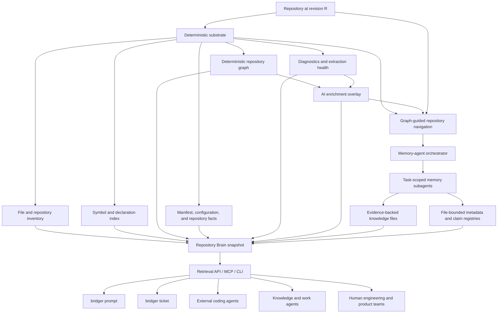
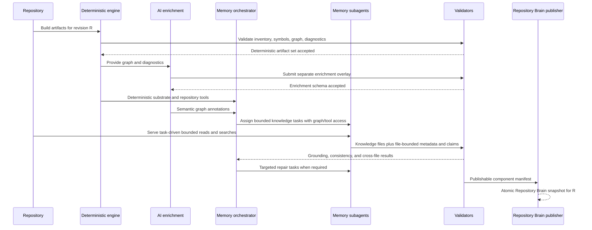
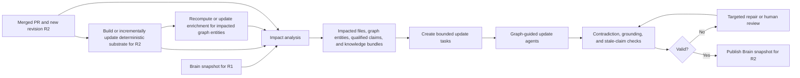

# Bridger — Product Vision and Core Engine Design

**Status:** Foundational product and architecture document  
**Date:** 4 August 2026  
**Scope:** Product vision, core engine responsibilities, ownership boundaries, data flows, artifact model, agent roles, and initial product surfaces.

---

## 1. Executive summary

Bridger is a **repository intelligence and knowledge system** designed to make a software codebase understandable and usable by humans and AI systems over time.

Its central product is the **Repository Brain**: a versioned, shareable, provider-agnostic representation of a repository that combines:

1. deterministic facts extracted from the repository;
2. AI-generated annotations over those facts;
3. evidence-backed knowledge about architecture, business logic, conventions, testing, and other important topics;
4. retrieval and access interfaces for coding agents, product teams, and downstream applications.

Bridger is not intended to replace the repository or become an ungrounded AI-generated wiki. The repository at a specific revision remains the ultimate source. Deterministic artifacts provide the canonical machine-derived view of observable repository facts. AI-generated knowledge remains explicitly derived, versioned, attributable, and linked to concrete repository evidence.

The initial product vision is a **Karpathy-style LLM wiki applied to software repositories**: durable knowledge files optimized for both humans and language models, enriched with machine-readable metadata and claim-level references to the underlying code.

The first downstream products are:

- **`bridger prompt`** — generate detailed, repository-aware technical prompts for coding agents;
- **`bridger ticket`** — transform product intent into grounded technical specifications and implementation tickets.

The Repository Brain should also be consumable by any external AI through a stable read interface, with an MCP server as the preferred first integration surface.

---

## 2. Product vision

### 2.1 The problem

Software repositories contain source code, configuration, tests, manifests, documentation, and history, but they rarely contain a complete and current explanation of how the system works.

Every engineer or AI agent entering a codebase must repeatedly rediscover:

- the repository structure;
- application entrypoints;
- subsystem boundaries;
- important workflows;
- state and persistence ownership;
- external integrations;
- coding and naming conventions;
- testing expectations;
- architectural constraints;
- business concepts represented in code;
- areas of uncertainty or technical debt.

This rediscovery is expensive, inconsistent, and usually trapped inside a single person's memory or a temporary AI conversation. Current coding assistants also tend to build their own private, provider-specific context, which cannot easily be inspected, versioned, shared, or reused by a team.

### 2.2 The Bridger thesis

A repository should have a durable intelligence layer that is:

- **grounded** in actual source files and repository facts;
- **structured** enough for deterministic retrieval and validation;
- **readable** by both humans and language models;
- **versioned** with the repository;
- **maintained** as the codebase changes;
- **provider-agnostic** so any AI system can consume it;
- **shared** so a team does not repeatedly pay the cost of rediscovery.

Bridger creates that layer.

### 2.3 Product outcome

For a repository at revision `R`, Bridger should be able to produce a Repository Brain snapshot that answers:

- What is this repository and how is it organized?
- What are the important runtime components and entrypoints?
- How do the main workflows operate end to end?
- Which files and symbols implement each behavior?
- What architectural and design patterns are used?
- What conventions should contributors follow?
- How is the system tested?
- Which claims are certain, inferred, contradictory, stale, or unknown?
- What context should an AI receive for a particular task?

The answer must not be only prose. It must be backed by machine-readable artifacts, evidence references, revision metadata, and explicit derivation boundaries.

---

## 3. Core product principles

### 3.1 Repository-first grounding

The source repository at a known revision is the ultimate authority. Every other artifact is a projection, annotation, or interpretation of it.

### 3.2 Deterministic facts and AI knowledge remain separate

Deterministic extraction and AI interpretation must never be merged into one indistinguishable artifact.

- Deterministic facts describe what can be directly observed or computed.
- AI enrichment describes interpretations of deterministic structures.
- Knowledge documents synthesize evidence into useful explanations.

Each layer has a different confidence model, update policy, and validation standard.

### 3.3 Evidence before narrative

Important knowledge claims must reference concrete evidence such as:

- repository-relative file paths;
- exact line ranges;
- symbol identifiers;
- graph node and edge identifiers;
- manifests or configuration declarations;
- tests;
- repository revision and content digest;
- relevant pull requests or diffs for incremental updates.

Markdown is a presentation format, not sufficient grounding by itself.

### 3.4 Progressive disclosure

Consumers should receive only the context relevant to their current task. The Repository Brain must support compact orientation, targeted retrieval, and deeper evidence expansion rather than requiring entire repositories or entire wiki files to be loaded into a model context.

### 3.5 Durable state over transient conversation

Agent runs must store evidence, findings, plans, coverage, and artifacts outside the model transcript. A conversation is temporary execution context, not the system of record.

### 3.6 Read-mostly core

Graph-guided repository exploration, enrichment, knowledge generation, and retrieval are read-mostly operations. Product features consume the brain through controlled interfaces. Direct mutation of canonical artifacts by downstream products is prohibited.

### 3.7 Versioned and provider-agnostic

Repository intelligence should not be locked to one model provider, agent framework, or IDE. Artifacts should be ordinary versionable files with stable schemas and interfaces.

### 3.8 Explicit uncertainty

Unknown, contradictory, incomplete, and weakly supported knowledge must be represented explicitly rather than hidden behind confident prose.

---

## 4. Conceptual model

Bridger distinguishes six principal concepts.

| Concept | Meaning | Authority |
|---|---|---|
| **Repository** | Source files and Git history at a concrete revision | Ultimate source |
| **Deterministic substrate** | Machine-derived inventory, symbols, graph structures, manifests, and diagnostics | Canonical for extracted observable facts |
| **AI enrichment overlay** | AI-generated labels, scores, classifications, and explanations attached to graph entities | Derived and non-canonical |
| **Evidence-backed knowledge** | Claims and explanations synthesized from repository evidence | Derived, attributable, and maintainable |
| **Repository Brain** | The complete published package combining deterministic artifacts, enrichment, knowledge, metadata, and retrieval indexes | Product-level read model |
| **Product features** | Interfaces and workflows that consume the Repository Brain | Consumers only |

The Repository Brain is therefore not one file or one graph. It is a **versioned composite snapshot**.

---

## 5. Core architecture



### 5.1 Architectural layers

1. **Repository source layer**
2. **Deterministic intelligence layer**
3. **AI graph-enrichment layer**
4. **Memory-agent generation and maintenance layer**
5. **Repository Brain publication layer**
6. **Retrieval and product-consumption layer**

Graph-guided repository navigation is a shared capability used inside the memory-agent layer, not a separate interpretation or handoff layer. These layers have explicit ownership boundaries and must not silently overwrite each other's data.

---

## 6. Repository source layer

### Responsibility

The repository source layer provides the exact codebase state being analyzed.

### Required identity

Every Bridger run and Repository Brain snapshot must identify:

- repository identity;
- Git revision or commit SHA;
- branch when relevant;
- workspace scope in a monorepo;
- generation timestamp;
- artifact schema versions.

### Boundary

Bridger may read and index the repository, but generated intelligence does not become source-code truth merely because it is stored beside the repository.

The repository revision is the anchor used to determine whether a fact or claim is current, stale, or invalid.

---

## 7. Deterministic substrate

### 7.1 Purpose

The deterministic substrate is the first layer of repository intelligence. It converts the repository into clean, reproducible, machine-readable artifacts that can be safely consumed by AI agents and product features.

Graphify components will be reused where they are suitable, particularly for graph construction and graph-oriented repository analysis. Bridger owns the product contract, validation, packaging, and lifecycle of the resulting artifacts.

### 7.2 Responsibilities

The deterministic substrate should produce and validate:

- a Git-aware file index;
- repository and workspace metadata;
- language and content classification;
- file size, line count, digest, and read-policy metadata;
- manifests, scripts, declared entrypoints, and configuration facts;
- stable symbol identities and declaration ranges;
- deterministic graph nodes and edges;
- community and structural graph outputs produced without model inference;
- extraction-health and graph-quality diagnostics;
- repository revision and artifact checksums.

### 7.3 Deterministic graph

The deterministic graph models directly extractable relations such as:

- file containment;
- symbol ownership;
- imports and dependencies;
- declarations and references where supported;
- manifest-declared relationships;
- test-to-source associations where deterministically established;
- repository or package boundaries;
- structural communities produced by deterministic graph algorithms.

The graph may expose high-centrality entities, including Graphify's concept of **god nodes**, but it must not attach semantic architectural meaning unless that meaning was deterministically declared in source metadata.

### 7.4 What the deterministic layer may claim

Examples:

- File `src/app.py` exists at revision `R`.
- Symbol `CallManager` is declared in a specified range.
- Module `A` imports module `B`.
- A manifest declares a script or entrypoint.
- A graph algorithm assigned nodes to a community.
- A node has a computed centrality value.
- An import could not be resolved and is classified as a probable internal unresolved import.

### 7.5 What the deterministic layer may not claim

Examples:

- A community represents “billing orchestration” unless explicitly declared.
- A high-centrality class is architecturally well designed.
- An edge is semantically important to the business.
- A subsystem follows a particular design pattern based on model interpretation.
- A workflow behaves a certain way without direct deterministic evidence.

### 7.6 Immutability and revisioning

Deterministic artifacts are immutable for a given repository revision and extractor version. AI systems do not edit these artifacts in place.

A new repository revision or extractor version produces a new artifact set or a validated incremental equivalent.

### 7.7 Boundary

The deterministic substrate is canonical for **extracted observable facts**, but it is not the sole source of truth for the repository and it is not a complete semantic model of the system.

---

## 8. AI enrichment overlay

### 8.1 Purpose

The AI enrichment layer adds useful semantic interpretation to deterministic graph structures while preserving the original graph unchanged.

A smaller capable model, initially a model in the class of `5.6-luna`, can perform this pass efficiently.

### 8.2 Initial responsibilities

The enrichment pass may:

- name deterministic graph communities;
- name or classify high-centrality/god nodes;
- score nodes, edges, and communities using defined metrics;
- explain why a graph entity may be important;
- identify potentially anomalous graph structures;
- propose semantic labels and categories;
- attach confidence and supporting deterministic features.

The exact metrics and scoring semantics are intentionally deferred to a later design task.

### 8.3 Output contract

AI enrichment must be stored in a separate overlay keyed by stable deterministic graph identifiers.

Each annotation should include at least:

- enrichment record ID;
- target graph entity ID and type;
- repository and graph revision;
- annotation type;
- generated label, score, or explanation;
- confidence;
- deterministic features used;
- model and prompt/version metadata;
- generation timestamp;
- status such as active, superseded, rejected, or stale.

### 8.4 Boundary

The enrichment layer:

- **does not modify the deterministic graph**;
- **does not convert inferred labels into deterministic facts**;
- **does not write repository knowledge documents directly**;
- **does not become authoritative merely because an annotation has high confidence**.

Its output is a reusable semantic overlay for memory agents, retrieval, and visualization.

---

## 9. Graph-guided repository exploration

### 9.1 Purpose

Repository exploration is a capability used directly by memory agents while completing bounded knowledge tasks. It is not a standalone preprocessing layer between the enriched repository graph and those agents.

The deterministic graph and AI enrichment overlay together provide the primary repository map. Agents use that map to identify important communities, high-centrality entities, structural relationships, and likely investigation paths, then use repository navigation tools to verify behavior in source files, symbols, manifests, configuration, and tests.

Bridger deliberately avoids an additional repository-wide interpretation layer between enriched graph facts and the agents. Re-synthesizing the repository into another general handoff artifact would add operational complexity and risk semantic distillation, omitted evidence, and intelligence loss before the task-specific agent has begun its work.

### 9.2 Inputs

An exploring agent may consume:

- deterministic substrate artifacts;
- the AI enrichment overlay;
- the file and symbol indexes;
- graph-neighborhood, community, and entity-navigation tools;
- safe repository search and bounded-read tools;
- source files and repository metadata;
- its bounded task, constraints, budgets, and current durable run state.

### 9.3 Responsibilities

While completing its assigned task, an agent should:

- use the enriched graph as the initial map of the repository;
- navigate from communities and important nodes into relevant files and symbols;
- inspect implementation evidence rather than relying only on graph labels or symbol existence;
- follow relevant workflows, dependencies, configuration, persistence, integrations, failures, and tests as required by the task;
- record exact evidence references for substantive claims;
- preserve contradictions, uncertainty, and unsupported areas;
- produce or update the knowledge file or files owned by its task.

Agents do not emit a separate repository-wide plan or package handoff. Their durable outputs are the evidence-backed Repository Brain knowledge files and their file-bounded metadata.

### 9.4 Direct graph-to-agent handoff

The deterministic substrate and AI enrichment overlay replace the need for an intermediate repository interpretation artifact. The handoff to an agent consists of:

- a bounded knowledge-generation or maintenance task;
- access to the enriched graph and deterministic repository artifacts;
- safe tools for autonomous repository navigation;
- explicit output, evidence, quality, and budget requirements.

The task is bounded; the input file set is not preselected. An agent may explore any repository area needed to complete its task, subject to repository policy and execution budgets.

### 9.5 Runtime design

Repository exploration inside an agent should use:

- durable structured state rather than accumulated transcript history;
- objective-oriented execution within the assigned task;
- a fresh context compiler for each model turn;
- deterministic context and execution budgets;
- graph-, evidence-, and task-aware retrieval;
- typed completion and verification policies;
- explicit checkpoints and resumability as the architecture matures.

### 9.6 Boundary

The enriched graph guides exploration but does not replace source verification. Agents may interpret repository behavior and write grounded knowledge, but they do not overwrite deterministic facts or AI-enrichment records, and they do not publish unvalidated Repository Brain snapshots.

---

## 10. Memory agent fleet

### 10.1 Purpose

Memory agents create, maintain, validate, and incrementally update the evidence-backed knowledge portion of the Repository Brain.

### 10.2 Initial-generation system

The initial fleet is designed as an orchestrator-and-subagents system.

The orchestrator owns the global Repository Brain generation run. It should:

- decompose the desired Repository Brain scope into bounded tasks;
- select and assign task-scoped subagents;
- provide each subagent with the deterministic substrate, enrichment overlay, repository-navigation tools, policies, and budgets;
- track task progress, coverage, overlap, contradictions, and failures;
- coordinate dependencies between tasks;
- validate and reconcile returned knowledge-file outputs;
- decide when the requested Repository Brain scope is complete enough for publication.

Each subagent receives a **bounded task**, not a bounded package of input files. It autonomously navigates the repository through the enriched graph, file index, symbol index, and source tools, then creates or updates the Repository Brain file or files within its assigned scope.

A likely initial model allocation is:

- a SOTA reasoning model in the class of `5.6-sol` for orchestration, decomposition, arbitration, and final cross-file reconciliation;
- smaller capable models in the class of `5.6-luna` for task-scoped repository exploration and knowledge generation.

This allocation is a design direction rather than a fixed provider contract. Model selection remains replaceable and should be benchmarked.

The previous fixed five-target taxonomy is not part of the current architecture. The initial Repository Brain targets, their boundaries, and the first fleet composition will be defined in a dedicated later task.

### 10.3 Maintenance agents

Maintenance agents protect knowledge quality over time. Their responsibilities include:

- detecting contradictions between claims within and across knowledge files;
- detecting conflicts between knowledge files and current repository facts;
- identifying stale claims after repository changes;
- checking for orphaned or invalid evidence references;
- reconciling overlapping knowledge documents;
- detecting unsupported certainty or scope expansion;
- proposing targeted repairs;
- preserving unresolved contradictions when they cannot be safely resolved.

Maintenance agents must consume both the existing knowledge and its underlying evidence. They may navigate the repository when required and must not validate a memory file only by comparing it with other generated prose.

### 10.4 Incremental update agents

Incremental update agents react to repository changes, particularly merged pull requests.

They consume:

- the previous Repository Brain snapshot;
- the previous and current deterministic substrates;
- the previous and current enrichment overlays where relevant;
- the new repository revision;
- the pull request diff and metadata when available;
- impacted graph entities, files, symbols, file-bounded claims, and memory documents.

The orchestrator converts impact information into bounded update tasks. Update agents use the graph and repository tools to verify the affected behavior, update only the relevant knowledge where possible, and run targeted grounding and contradiction checks.

### 10.5 Agent boundaries

Memory agents:

- do not alter deterministic artifacts or enrichment records;
- may autonomously explore the repository as needed to complete their bounded task;
- do not write claims without repository evidence references;
- do not silently delete unresolved knowledge;
- do not publish directly without schema, grounding, and cross-file validation;
- do not own product-query behavior;
- do not treat graph annotations as verified implementation behavior without source inspection where the claim requires it.

---

## 11. Evidence-backed knowledge model

### 11.1 Why Markdown alone is insufficient

Markdown is ideal for human and LLM consumption, but an unstructured Markdown wiki cannot reliably support:

- claim-level provenance;
- stale-knowledge detection;
- contradiction analysis;
- targeted updates;
- confidence and uncertainty tracking;
- deterministic validation;
- revision-aware retrieval.

Bridger should therefore publish each Markdown knowledge file as a self-contained knowledge bundle with file-bounded metadata and claims.

### 11.2 Knowledge file bundle

Each Repository Brain knowledge file should be accompanied by metadata that belongs specifically to that file. The physical representation may use front matter, sidecars, or both, but the logical boundary is stable:

```text
<memory-id>.md
<memory-id>.meta.json
<memory-id>.claims.json
```

Each bundle should contain or identify:

- stable document ID;
- repository and Brain revision;
- topic, purpose, and explicit scope;
- generation and last-validation timestamps;
- generator and maintainer metadata;
- task and model provenance;
- coverage summary for that file's scope;
- warnings, contradictions, and unknowns;
- inline references from prose to claims owned by that file;
- links from each claim to repository evidence;
- relationships to other knowledge files when required.

A conceptual Markdown format:

```markdown
---
document_id: memory.<scope>
schema_version: 1
repository_revision: <commit-sha>
brain_revision: <brain-id>
metadata_path: memory.<scope>.meta.json
claims_path: memory.<scope>.claims.json
status: active
---

# <Knowledge scope>

A grounded repository statement appears here. [claim:claim.<local-id>]
```

### 11.3 File-bounded metadata and claim registry

Claims are registered within the knowledge file that owns and presents them. Bridger does not require one repository-wide canonical claim registry.

A file-bounded claim record should include:

```text
document_id
claim_id
statement
claim_type
local topic and scope
repository_revision
status
confidence
evidence references
deterministic dependencies
derived-from claims
contradicts / supersedes relationships
first introduced and last validated timestamps
generator and validator metadata
```

Claim IDs should be stable within their owning document and externally addressable using a qualified reference such as `<document_id>#<claim_id>`. Cross-file relationships and contradictions may use those qualified references, while the Repository Brain manifest only indexes the available knowledge bundles and their checksums.

### 11.4 Evidence references

Evidence references may point to:

- file path and exact line range;
- stable symbol ID and declaration/body range;
- deterministic graph node or edge ID;
- manifest declaration;
- test or fixture;
- PR diff hunk;
- repository fact artifact;
- a claim in another knowledge file, when the dependency is explicit and that claim's own grounding remains available.

Each reference should carry the repository revision and, where practical, a content digest so drift can be detected.

### 11.5 Knowledge status

Claims and documents should support statuses such as:

- active;
- stale;
- superseded;
- contradictory;
- partially verified;
- rejected;
- unknown;
- excluded.

### 11.6 Boundary

Each knowledge file and its metadata/claim sidecars are the canonical record of **what that file currently asserts and why**. The source repository remains the ultimate authority, and deterministic artifacts remain canonical for extracted facts.

The Repository Brain manifest catalogs file bundles and publication status but does not centralize or silently rewrite their claims. Cross-file maintenance is performed by agents and validators over the file-bounded registries.

---

## 12. The Repository Brain

### 12.1 Definition

The Repository Brain is the published, revisioned product snapshot that combines:

- repository identity;
- deterministic repository artifacts;
- graph-enrichment overlay;
- evidence-backed knowledge files;
- file-bounded metadata and claim registries;
- coverage, freshness, and quality metadata;
- retrieval indexes and access manifests.

### 12.2 Logical composition

```text
Repository Brain
├── Deterministic facts
│   ├── file and repository inventory
│   ├── symbols and declarations
│   ├── graph nodes and edges
│   ├── manifests and configuration facts
│   └── extraction and quality diagnostics
├── AI enrichment
│   ├── community names
│   ├── god-node/high-centrality labels
│   ├── entity and edge scores
│   └── semantic annotations
├── Knowledge bundles
│   ├── <memory-target-a>.md
│   ├── <memory-target-a>.meta.json
│   ├── <memory-target-a>.claims.json
│   ├── <memory-target-b>.md
│   └── corresponding file-bounded metadata and claims
├── Grounding
│   ├── evidence references inside each knowledge bundle
│   ├── cross-file contradictions and relationships
│   ├── warnings and unknowns
│   └── freshness and validation status
└── Access
    ├── retrieval metadata
    ├── MCP resources and tools
    ├── CLI interfaces
    └── internal APIs
```

The concrete starting memory targets are intentionally not fixed in this document.

### 12.3 Suggested V0 artifact layout

```text
.bridger/
├── artifacts/
│   ├── file-index.json
│   ├── repo-context.json
│   ├── symbol-index.json
│   ├── repo-graph.json
│   └── graph-summary.json
├── enrichment/
│   └── graph-enrichment.json
├── memory/
│   ├── manifest.json
│   ├── <memory-id>.md
│   ├── <memory-id>.meta.json
│   └── <memory-id>.claims.json
├── runs/
│   └── <memory-generation-run-artifacts>
└── brain-manifest.json
```

The exact filenames may evolve, but the separation between deterministic artifacts, enrichment, file-bounded knowledge bundles, run artifacts, and the published Brain manifest should remain stable.

### 12.4 Brain manifest

The Brain manifest should identify:

- repository revision;
- Brain snapshot ID;
- schema versions;
- deterministic and enrichment artifact paths and checksums;
- every published knowledge bundle and its component checksums;
- generator versions;
- models and prompt versions used;
- validation status;
- known stale or partial components;
- creation and publication timestamps.

It may provide a searchable catalog of files and topics, but it is not a repository-wide claims store.

### 12.5 Publication semantics

A Repository Brain snapshot should be published atomically only after required validation passes. Consumers should never observe a mixture of artifacts from different repository revisions or mismatched Markdown, metadata, and claim sidecars.

---

## 13. Authority and ownership boundaries

### 13.1 Authority hierarchy

```text
Repository at revision R
    ↓
Deterministic substrate for R
    ↓
AI enrichment overlay for R
    ↓
Evidence-backed, file-bounded knowledge for R
    ↓
Rendered retrieval views and product outputs
```

Each lower layer may derive value from the layer above it but cannot retroactively redefine the authority of the upper layer.

### 13.2 Component ownership

| Component | Owns | Must not own |
|---|---|---|
| **Graphify-derived deterministic engine** | Graph extraction, graph algorithms, deterministic graph entities and relations | Semantic labels or repository knowledge prose |
| **Bridger deterministic packaging** | Git inventory, artifact contracts, revisioning, checksums, validation, diagnostics | AI interpretations |
| **AI enrichment layer** | Versioned annotations over graph IDs | Direct graph mutation or deterministic fact creation |
| **Memory-agent orchestrator** | Brain-scope decomposition, bounded task assignment, coordination, reconciliation, and completion decisions | Deterministic fact creation or direct product-query behavior |
| **Memory subagents** | Autonomous graph-guided exploration and task-scoped knowledge-file generation or update | Free mutation of graph/index artifacts or ungrounded publication |
| **File-bounded metadata and claim registries** | Provenance, status, dependencies, contradictions, and freshness for one knowledge file | Repository-wide source-code authority or hidden cross-file mutation |
| **Repository Brain publisher** | Consistent composite snapshot and manifest | Independent semantic invention |
| **MCP/API/CLI layer** | Retrieval and presentation | Canonical knowledge mutation |
| **`bridger prompt` / `bridger ticket`** | Task-specific outputs derived from Brain context | Writing directly into canonical memory |

### 13.3 Mutation policy

Only dedicated producer workflows may mutate their owned layer:

- deterministic build updates deterministic artifacts;
- enrichment pass updates enrichment records;
- orchestrated memory generation/update workflows update knowledge files and their file-bounded sidecars;
- the publisher creates a new Brain snapshot.

Downstream consumers are read-only. Feedback from consumers may create a proposed correction or maintenance task, but not an immediate canonical write.

---

## 14. End-to-end data flows

### 14.1 Initial repository initialization



No repository-wide interpretation handoff is generated between enrichment and memory agents. The enriched graph is the navigation map; each task-scoped agent retrieves and verifies the source evidence it needs.

### 14.2 Query and retrieval flow

1. A consumer submits a task or question.
2. The retrieval layer identifies the relevant repository revision and scope.
3. It retrieves the minimum useful combination of:
   - deterministic facts;
   - relevant graph annotations;
   - relevant knowledge-file sections and file-bounded claims;
   - supporting evidence references;
   - warnings, contradictions, and freshness status.
4. It returns a bounded context package through MCP, API, or CLI.
5. The consuming AI or product performs its task without loading the entire Repository Brain.

### 14.3 Pull-request and incremental update flow



The deterministic update must occur before AI knowledge updates. The updated graph, enrichment, and inventory establish which previous references remain valid and guide the update agents toward the affected source.

### 14.4 Maintenance flow

Maintenance may be triggered by:

- a repository revision change;
- a scheduled quality audit;
- contradictory claims within or across knowledge files;
- a failed evidence reference;
- a user or agent correction proposal;
- a schema or extractor upgrade;
- low-confidence or incomplete knowledge within a file's declared scope.

The maintenance orchestrator creates bounded validation or repair tasks. Agents may navigate the repository to re-establish evidence. The workflow should create a new validated snapshot rather than silently editing a published snapshot in place.

---

## 15. Retrieval and access layer

### 15.1 Purpose

The access layer turns the composite Repository Brain into task-specific context. It protects consumers from artifact layout details and prevents indiscriminate context loading.

### 15.2 MCP server

An MCP server is the preferred first universal interface because it allows external agents to consume Bridger without adopting Bridger's internal runtime.

Potential MCP resources:

- repository overview;
- memory document catalog;
- individual memory sections;
- graph communities and high-centrality nodes;
- claim details, owning knowledge files, and evidence;
- freshness and quality status;
- repository change impact summaries.

Potential MCP tools:

- search repository knowledge;
- retrieve context for a task;
- expand a claim to its evidence;
- inspect graph neighborhood;
- list relevant files and symbols;
- retrieve conventions for a path;
- retrieve testing guidance for an area;
- generate a bounded coding-agent context package.

The MCP server is read-only in V0. Mutation should remain behind authenticated Bridger maintenance workflows.

### 15.3 Internal retrieval contract

Retrieval should be able to filter and rank by:

- task intent;
- topic;
- file, directory, symbol, graph node, or community;
- repository revision;
- owning knowledge file, claim confidence, and status;
- semantic area or workflow;
- freshness;
- evidence strength;
- context budget.

### 15.4 Consumer response requirements

A context package should clearly distinguish:

- deterministic facts;
- AI-derived interpretation;
- current file-bounded knowledge claims;
- uncertainty and contradictions;
- supporting references;
- omitted context and retrieval limits when relevant.

---

## 16. Product features

### 16.1 `bridger prompt`

#### Goal

Generate a detailed, technically actionable prompt for a coding agent using durable repository knowledge rather than relying on a user to describe the codebase manually.

#### Inputs

- user intent or requested change;
- optional ticket, files, subsystem, or constraints;
- target coding agent/provider when formatting differences matter;
- repository revision or current workspace state.

#### Repository Brain usage

`bridger prompt` should retrieve:

- affected architecture and workflows;
- likely files and symbols;
- relevant coding and naming conventions;
- relevant tests and validation commands;
- integration, persistence, and failure constraints;
- warnings, open questions, and known uncertainty;
- evidence references suitable for agent navigation.

#### Output

A task-specific coding-agent prompt containing:

- objective and scope;
- repository context;
- expected implementation areas;
- constraints and invariants;
- acceptance criteria;
- testing and validation instructions;
- relevant references;
- explicit uncertainty where the Brain is incomplete.

It should not blindly paste all memory files.

### 16.2 `bridger ticket`

#### Goal

Allow product and non-technical teams to propose changes using repository-grounded technical specifications.

#### Inputs

- product problem or feature request;
- user outcome;
- business constraints;
- optional screenshots, examples, or acceptance criteria.

#### Repository Brain usage

`bridger ticket` should map product intent to:

- existing business workflows and domain concepts;
- likely services, components, and ownership boundaries;
- relevant data and persistence behavior;
- integrations and downstream effects;
- implementation constraints and conventions;
- tests and observability requirements;
- uncertainties requiring engineering clarification.

#### Output

A structured technical specification or ticket containing:

- problem statement;
- user and business outcome;
- current-system context;
- proposed scope;
- likely technical approach without pretending certainty;
- affected areas;
- functional and non-functional requirements;
- acceptance criteria;
- test plan;
- risks, dependencies, and open questions;
- source references when useful.

### 16.3 External coding agents

External coding agents should use Bridger as a context and navigation provider. Bridger should not require them to use a particular model vendor or agent harness.

### 16.4 Future knowledge and work agents

The Repository Brain can later support agents for:

- onboarding;
- architecture review;
- incident investigation;
- change impact analysis;
- PR review;
- documentation generation;
- migration planning;
- test planning;
- technical-debt triage;
- cross-team knowledge discovery.

These remain downstream consumers and should not bypass the canonical maintenance workflow.

---

## 17. Agent-runtime design requirements

The AI layers of Bridger must be capable of long-running work without depending on indefinitely growing model context.

### 17.1 Durable state

Persist, as appropriate for each orchestrated run and active task:

- task assignments and ownership;
- evidence records and exact inspected ranges;
- findings and relationships needed by the active knowledge file;
- open questions and contradictions;
- file-scope coverage and completion status;
- active objectives;
- budget and progress status;
- context-selection manifests;
- checkpoints, subagent results, and run metadata.

Durable working state is a runtime concern. It is not a new repository-wide semantic artifact inserted between the enriched graph and memory agents.

### 17.2 Context compilation

Every model request should be built from current durable state, the bounded task, relevant graph slices, and retrieved repository evidence. Full historical tool output and repeated prior prompts should not be replayed.

### 17.3 Objective-oriented execution

Generation and maintenance tasks should be divided into bounded objectives such as:

- orient to the graph communities relevant to the assigned knowledge scope;
- trace one workflow required by the task;
- validate one persistence or integration claim;
- complete one section of a knowledge file;
- update file-bounded claims affected by a PR;
- resolve one contradiction;
- refresh one memory bundle.

### 17.4 Deterministic governance

The harness, not the model, owns:

- orchestrator and task lifecycle;
- context and execution budgets;
- state persistence;
- retries and no-progress limits;
- validation and completion gates;
- checkpointing;
- merge and publication authority.

### 17.5 Typed verification

Use objective checks where possible:

- schema validity;
- safe path and range validity;
- evidence-reference validity;
- deterministic graph identity validity;
- knowledge-file scope and required coverage;
- contradiction detection;
- revision freshness;
- Markdown-to-file-bounded-claim resolution;
- no unsupported central claims;
- consistency between each Markdown file and its metadata/claim sidecars.

Generic self-reflection is not a substitute for typed verification.

---

## 18. Versioning, sharing, and provider independence

### 18.1 Repository revisioning

Every artifact, knowledge file, and file-bounded claim is tied to a repository revision. A consumer must be able to determine whether it is reading knowledge for the current code state.

### 18.2 Brain revisions

A Brain snapshot receives its own revision or content-derived ID because the same repository commit may be reprocessed by a newer extractor, prompt, model, or validation policy.

### 18.3 Schema and generator versions

Artifacts should record:

- schema version;
- Graphify/deterministic extractor version;
- Bridger runtime version;
- memory agent version;
- prompt/policy version;
- model profile where AI output is involved.

### 18.4 Git and team sharing

V0 artifacts should be ordinary files that can be:

- stored in the repository when appropriate;
- reviewed through Git diffs;
- shared across a team;
- cached in CI or a Bridger service;
- exported without proprietary infrastructure.

Large or operational run artifacts may be excluded from Git while published Brain artifacts remain versioned.

### 18.5 Provider independence

Knowledge artifacts and retrieval contracts must not depend on proprietary message formats. Provider-specific adapters may format a retrieved context package, but the underlying Brain remains portable.

---

## 19. Quality, validation, and trust

### 19.1 Deterministic artifact quality

The deterministic layer should report extraction health rather than presenting incomplete output as complete. Relevant diagnostics include:

- indexed versus excluded files;
- parse success and failure counts;
- resolved, external, unresolved, ignored, and unsupported relationships;
- symbol extraction coverage;
- graph density and suspiciously sparse outputs;
- repository areas or languages with limited support.

### 19.2 Enrichment quality

AI enrichment validation should check:

- target graph IDs exist;
- annotations do not overwrite deterministic fields;
- scores conform to metric definitions;
- confidence and model metadata are present;
- stale annotations are detected after graph changes;
- duplicate or contradictory labels are surfaced.

### 19.3 Knowledge quality

Knowledge validation should require:

- every substantive claim has valid evidence;
- evidence belongs to the correct repository revision;
- claim scope does not exceed evidence scope;
- central behavioral claims use implementation-level evidence, not symbol existence alone;
- contradictions and unknowns are preserved;
- Markdown claim references resolve;
- no document contains orphan claims;
- stale claims are marked or updated;
- duplicate or conflicting coverage across knowledge files is controlled;
- final writes are atomic.

### 19.4 Human inspectability

A human reviewer must be able to answer:

- Why does Bridger believe this?
- Which code supports the claim?
- Which model or agent generated it?
- When was it last checked?
- Is it deterministic or inferred?
- What changed since the previous revision?

### 19.5 Observability

Runs should persist enough metadata to evaluate:

- model and tool usage;
- context size and selected evidence;
- budget consumption;
- objectives completed, blocked, or exhausted;
- claims created, updated, superseded, or rejected;
- coverage achieved;
- validation failures and repairs;
- publication status.

---

## 20. Security and safety boundaries

### 20.1 Repository read policy

Inventory and read eligibility are separate. A tracked file may be represented as:

- readable text;
- bounded-read only;
- metadata only because it is binary;
- metadata only because it is sensitive;
- excluded with an explicit reason.

### 20.2 Secret handling

Bridger should not persist secrets or sensitive raw content in evidence, memory files, logs, or model prompts. Sensitive findings should reference safe metadata or redacted evidence.

### 20.3 Model access

Memory-generation, maintenance, and update agents should default to repository-bounded, read-only tools. Shell, network, or external system access must be explicitly governed.

### 20.4 Publication safety

The publisher should validate that the Brain snapshot does not expose content prohibited by repository policy before sharing it through MCP or team interfaces.

---

## 21. V0 product scope

V0 should prove the Repository Brain concept end to end without attempting every future capability.

### 21.1 Required V0 components

1. **Deterministic substrate**
   - Git-aware file index;
   - repository metadata and manifests;
   - stable symbol index;
   - Graphify-derived deterministic graph;
   - graph and extraction diagnostics;
   - revisioned, validated artifacts.

2. **AI enrichment overlay**
   - names for graph communities;
   - labels for high-centrality/god nodes;
   - initial score fields with metric definitions added in a dedicated later task;
   - separate immutable overlay with provenance.

3. **Graph-guided memory-agent runtime**
   - orchestrator and task-scoped subagent contracts;
   - enriched-graph and repository-navigation tools;
   - bounded tasks, budgets, durable state, and checkpoints;
   - autonomous source exploration by subagents;
   - validation and cross-file reconciliation.

4. **Initial Repository Brain knowledge scope**
   - a first set of evidence-backed memory files sufficient to demonstrate the product;
   - concrete target names and boundaries defined by a dedicated follow-up design task;
   - no fixed legacy five-target taxonomy in this architecture.

5. **File-bounded grounding model**
   - Markdown knowledge files;
   - one metadata and claims boundary per knowledge file;
   - memory catalog/manifest without a centralized claim store;
   - file/symbol/graph evidence references;
   - warnings, unknowns, confidence, and revision metadata.

6. **Repository Brain publication**
   - composite manifest;
   - atomic snapshot;
   - version and checksum metadata.

7. **Product surfaces**
   - `bridger prompt`;
   - `bridger ticket`;
   - read-only MCP server or equivalent stable context API.

### 21.2 V0 user experience

A successful first-run experience should be:

```text
bridger init
→ build deterministic repository intelligence
→ enrich important graph structures
→ decompose the initial Brain scope into bounded memory tasks
→ let task-scoped agents navigate the graph and repository autonomously
→ generate evidence-backed knowledge files with file-bounded metadata and claims
→ validate and publish a Repository Brain snapshot
→ make the Brain available to bridger prompt, bridger ticket, and external AIs
```

The first “wow” effect should be that a user can ask Bridger for a technically detailed prompt or specification and receive an output that clearly understands the repository without the user manually assembling context.

### 21.3 V0 acceptance criteria

- The deterministic and AI-derived layers are physically and logically separate.
- The enriched graph can directly guide task-scoped agents through repository exploration.
- No separate repository-wide interpretation handoff is required between enrichment and memory generation.
- Memory agents receive bounded tasks and autonomous graph/tool access rather than preselected file packages.
- Every published knowledge claim can be traced to repository evidence.
- Each knowledge file's Markdown, metadata, and claim registry are internally consistent and revisioned together.
- Memory files can be read directly by humans and LLMs.
- A Brain snapshot identifies the repository revision and all component versions.
- `bridger prompt` retrieves targeted context rather than concatenating the entire Brain.
- `bridger ticket` maps product intent to grounded technical areas and explicit unknowns.
- An external AI can consume the Brain through a provider-neutral interface.
- Re-running at the same revision produces stable deterministic artifacts and clearly versioned AI-derived outputs.
- A repository change can identify stale references and impacted knowledge, even if full incremental updating is completed after the initial V0.

---

## 22. Evolution after V0

### Near-term

- define graph-enrichment metrics and evaluation methods;
- implement PR impact analysis and targeted memory updates;
- add contradiction and stale-claim maintenance agents;
- strengthen checkpointing and resumability;
- benchmark Repository Brain quality across diverse repositories;
- expose richer MCP graph and evidence tools;
- support scoped memories for monorepo subtrees.

### Medium-term

- organization-level knowledge across multiple repositories;
- ownership and team topology integration;
- issue tracker, ADR, documentation, and deployment-system connectors;
- historical architecture and change narratives;
- retrieval learning and task-specific context optimization;
- human review and approval workflows;
- richer query and visualization interfaces.

### Long-term

- a shared software-intelligence layer used by any coding or work agent;
- continuously maintained repository knowledge across teams;
- automatic change-impact and specification generation;
- organization-wide software maps linking product concepts to implementation;
- durable agent collaboration through a common, inspectable repository memory.

---

## 23. Explicit non-goals

Bridger is not, initially:

- a replacement for Git or the source repository;
- a generic autonomous code-editing agent;
- a provider-specific memory store;
- a vector database as the primary repository truth;
- a single unstructured generated wiki;
- a system where AI annotations mutate deterministic facts;
- a platform that requires all repository content to fit in one context window;
- a product that guarantees every architectural inference is correct;
- a direct-write knowledge surface for every downstream agent;
- an attempt to infer business meaning without evidence and uncertainty labels.

---

## 24. Deferred design decisions

The following decisions require separate focused specifications:

1. Exact definitions and calibration methods for node, edge, community, confidence, coherence, and quality scores.
2. The final Graphify integration boundary and artifact compatibility contract.
3. The initial Repository Brain memory targets, their scope boundaries, and the first subagent fleet composition.
4. The exact file-bounded metadata, claim, and evidence schemas, including front matter versus sidecar storage.
5. The orchestrator decomposition, assignment, reconciliation, and completion policies.
6. Stable graph/entity identity across repository revisions.
7. Incremental graph update versus deterministic full rebuild policy.
8. Brain snapshot retention and storage strategy.
9. Retrieval ranking and context-budget algorithms.
10. MCP resource and tool schemas.
11. Human correction, approval, and dispute workflows.
12. Benchmark design for graph-guided exploration, knowledge correctness, coverage, usefulness, freshness, and product impact.
13. Repository Brain behavior for uncommitted working-tree changes.
14. Cross-repository and organization-level knowledge boundaries.
15. Final model allocation between orchestrator and subagents.

Deferring these decisions does not change the core ownership model defined in this document.

---

## 25. Foundational architecture decisions

The following decisions are accepted and should guide later implementation work:

1. The Repository Brain is the central Bridger product.
2. It combines deterministic repository intelligence with evidence-backed AI knowledge.
3. The repository itself is the ultimate source; the deterministic substrate is canonical for extracted facts.
4. The deterministic substrate includes more than the graph: file inventory, symbols, manifests, facts, diagnostics, and revision metadata.
5. Graphify components will be reused for deterministic graph construction where appropriate.
6. AI enrichment is a separate overlay and never modifies the deterministic graph.
7. AI scoring semantics will be defined in a dedicated later task.
8. The deterministic graph plus AI enrichment overlay replace a separate repository-wide discovery and handoff layer.
9. Agents use the enriched graph as a repository map and verify claims through navigation tools and source evidence.
10. Memory agents receive bounded tasks, not bounded input-file packages.
11. The memory fleet is designed as an orchestrator with autonomous task-scoped subagents.
12. A likely initial allocation uses a SOTA model for orchestration and smaller capable models for subagents, subject to benchmarking.
13. The initial Repository Brain memory targets are deferred to a dedicated design task; the previous fixed taxonomy is not authoritative.
14. Memory files are grounded views backed by file-bounded metadata and claim registries, not an ungrounded wiki.
15. There is no repository-wide canonical claim registry; the Brain manifest catalogs knowledge bundles.
16. Maintenance agents validate knowledge against repository evidence and may explore the repository as required.
17. Incremental updates rebuild or update deterministic artifacts and relevant enrichment before modifying knowledge.
18. Product features consume the Repository Brain through stable retrieval interfaces and do not mutate it directly.
19. `bridger prompt` and `bridger ticket` are the first product features.
20. MCP is the preferred first universal interface for external AI consumers.
21. Artifacts are versioned, shareable, provider-agnostic, and designed for team use.
22. Durable state, bounded context, typed verification, and explicit uncertainty are core runtime requirements.

---

## 26. Definition of done for the core-engine architecture task

This document satisfies the core-engine architecture task when the following are accepted:

### Core layers and ownership boundaries

- The deterministic substrate and Graphify-derived graph responsibilities are defined.
- AI enrichment is defined as a non-canonical overlay.
- Graph-guided exploration is defined as a memory-agent capability rather than a standalone interpretation layer.
- The memory orchestrator, task-scoped subagents, Repository Brain publication, retrieval, and product consumers have separate ownership.
- Mutation rights and prohibited responsibilities are explicit.

### Data flow

- Initial repository initialization and direct graph-to-agent flow are defined.
- Query and retrieval flow is defined.
- PR-driven incremental update flow is defined.
- Maintenance and publication flow is defined.

### Deterministic versus AI-derived knowledge

- The repository is established as the ultimate source.
- Deterministic artifacts are established as canonical extracted facts.
- AI enrichment and knowledge claims are explicitly derived.
- Markdown documents are established as human- and LLM-readable knowledge files.
- File-bounded metadata and claim registries provide grounding, status, revision, and provenance.

### Product connection

- The Repository Brain is defined as the product-level composite.
- `bridger prompt`, `bridger ticket`, external coding agents, and future work agents are defined as consumers.
- MCP/API/CLI access is defined as a stable provider-neutral delivery layer.

---

## 27. Glossary

**AI enrichment overlay**  
A separate set of AI-generated annotations attached to stable deterministic graph entities.

**Brain snapshot**  
A consistent, immutable published version of the Repository Brain for a repository revision and a particular set of generator versions.

**Claim**  
An explicit Bridger assertion owned by one knowledge file, with status, confidence, scope, revision, and evidence references.

**Deterministic fact**  
A repository observation or computed structural result produced without model interpretation.

**Deterministic substrate**  
The complete set of revisioned deterministic repository artifacts, including file inventory, symbols, graph, manifests, repository facts, and diagnostics.

**Evidence**  
A concrete repository source supporting a claim, such as a file range, symbol, graph entity, manifest declaration, test, or diff.

**File-bounded claim registry**  
The claim records owned by one knowledge file and revisioned with that file's metadata and Markdown content.

**God node**  
Graphify terminology for a highly central or structurally dominant graph node. Semantic importance is not implied unless established separately.

**Graph-guided repository exploration**  
The task-scoped process by which an agent uses the enriched graph as a map, then navigates files, symbols, and other repository evidence to complete a bounded knowledge task.

**Knowledge file bundle**  
A Markdown knowledge file together with its file-specific metadata and claim records.

**Memory agent**  
A task-scoped agent responsible for generating, validating, maintaining, or updating an assigned portion of repository knowledge, with autonomous access to the enriched graph and repository-navigation tools.

**Memory-agent orchestrator**  
The agent or runtime component that decomposes Repository Brain scope into bounded tasks, coordinates subagents, reconciles outputs, and controls completion and publication readiness.

**Repository Brain**  
The composite, versioned product combining deterministic facts, AI enrichment, evidence-backed knowledge files, file-bounded metadata, and retrieval access.

**Rendered knowledge view**  
A human- and LLM-readable Markdown document grounded by its associated metadata, claims, and repository evidence.
